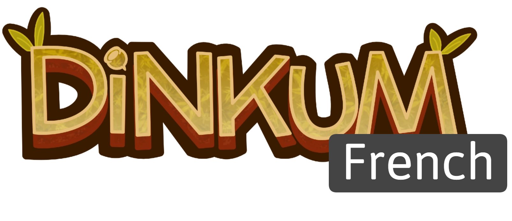

<h1 align="center">
   
  
</h1>

  
  
  
  

  <a href="#description">Description</a> •
  <a href="#how-to-use">How To Use</a> •
  <a href="#download">Download</a> •
  <a href="#prerequisites">Pre-requisites</a> •

  <a href="#credits">Credits</a> •
  <a href="mit-license">License</a>

[Menu principale (WIP)]

## Description
Based on the DinkumChinese mods, DinkumFrench translating the game to allow a better understanding of the game for non-English speaking players
## How To Use

To clone and run this application, you'll need [Git](https://git-scm.com) and [Visual studio](https://nodejs.org/en/download/) installed on your computer.

> **Note :**
> This is a mod, some missing dependencies will have to be added with the game DLLs.
## Download
You can [download](https://github.com/GaetanGrd/DinkumFrench/releases) the latest installable version of DinkumFrench for Windows.

## Prerequisites
to use this mod you need [BepInEx 6](https://modding.wiki/en/dinkum/users#bepinex-6-setup) installed on your game.

## Credits

This software uses the following open source packages:
- [BepInEx](https://github.com/BepInEx/BepInEx)
- [Harmony](https://github.com/pardeike/Harmony)
- [I2LocPatch](https://github.com/xiaoye97/I2LocPatch) (modified version!)
- [.NET Framework](https://dotnet.microsoft.com/en-us/)
- [Newtonsoft.json](https://www.newtonsoft.com/json)
- [Unity](https://unity.com/fr)
## Support

## Special thanks
- Geetaku (main translator)

## [MIT License](https://github.com/GaetanGrd/DinkumFrench/blob/main/LICENSE)

---

